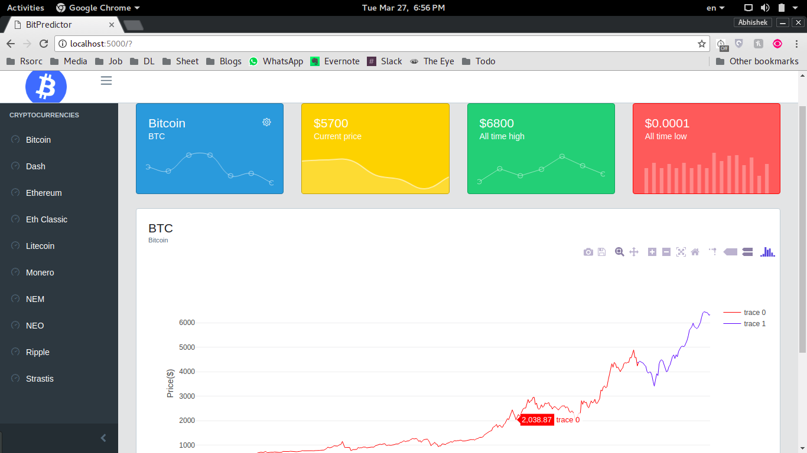
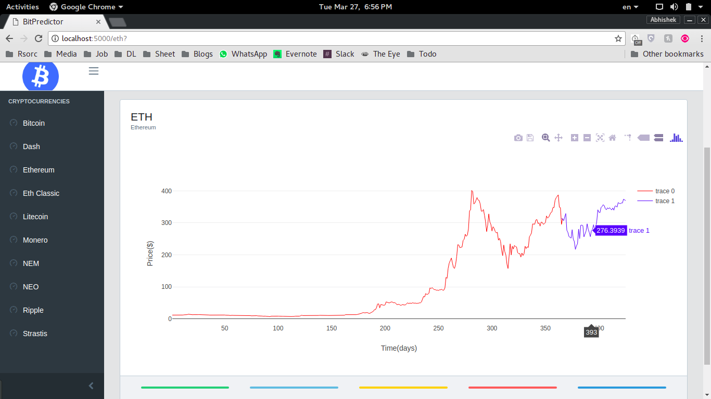

# Cryptocurrency Market Prediction using Machine Learning

- Used Automated Machine Learning libraries, TPOT, AutoSklearn for algorithm and pipeline selection

- Used Recurrent Neural Network for forcasting.

- Trained on 2 year data from Sep 2015 - Sep 2017
- Predicts the estimated prices of next 2 months

Start by command - 
``` 
python app/app.py.p
```



